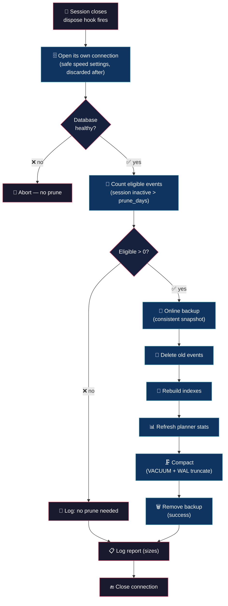

# DB Prunetor (keep opencode's brain lean)


> opencode's SQLite database grows forever. Event-sourcing rows pile up from sessions you'll never reopen. Your AI should not choke on its own history.

## 💡 What it does

> Lightweight, automatic database maintenance. You do nothing.

- **Copy and it works** — single TypeScript file, native `bun:sqlite`. No npm, no node_modules, no drama.

- **Runs on close** — maintenance fires on session `dispose`, when opencode releases its database connection. Zero startup cost, minimal contention.

- **Integrity gate** — it first proves the database is healthy. A suspect database is never pruned.

- **Safe online backup** — before any destructive change, a consistent snapshot of the database is written. No lock on the live database.

- **Event pruning** — deletes event history from sessions you haven't touched in a while, then rebuilds indexes and refreshes planner statistics to keep everything fast.

- **Reclaims the space** — after a real prune, the file is compacted (`VACUUM` + WAL truncate) so the freed space actually returns to disk, not just to the freelist.

## 🧠 Philosophy

Maintenance is a habit, not an emergency. A small, safe pass on every session close beats a scary 6 GB cleanup after months of neglect.

The plugin never blocks you, never touches opencode's own connection settings, and never mutates a database it cannot first prove is healthy.

## 🔄 How it works



## 🎯 Use cases

**Disk creep.** After weeks of sessions, `opencode.db-wal` and the `event` table bloat. The plugin trims the dead weight on every close.

**Replay safety.** Event-sourcing rows are only needed to reconstruct old sessions. Once a session goes inactive, its events are dead weight — the current state lives in `message`/`part`.

**Peace of mind.** An integrity gate plus an automatic online backup mean a prune can never be the thing that breaks your history.

## 🚀 Installation

```bash
cp db-prunetor.ts ~/.config/opencode/plugins/db-prunetor.ts
cp db-prunetor.jsonc ~/.config/opencode/db-prunetor.jsonc
```

No npm, no build step, no dependencies. OpenCode runs TypeScript natively. Restart opencode; maintenance runs automatically on close.

## ⚙️ Configuration

Copy `db-prunetor.jsonc` (included in this repo) to `~/.config/opencode/` and edit:

```jsonc
{
	"enabled": true,             // master switch
	"prune_days": 30,            // delete events from sessions inactive > N days
	"backup": true,              // pre-prune snapshot (<db_path>.bak); false = faster (single VACUUM), no restore point
	// "db_path":                // optional override; auto-detected if omitted
	"log_level": "info"          // "silent" | "error" | "info" | "debug"
}
```

| Field | Default | Description |
|---|---|---|
| `enabled` | `true` | Master switch |
| `prune_days` | `30` | Delete events from sessions inactive beyond this many days |
| `backup` | `true` | Pre-prune snapshot at `<db_path>.bak`. `false` = prune + compact in a single `VACUUM` pass (roughly half the time), at the cost of no restore point |
| `db_path` | *auto-detected* | Optional override for opencode's database location |
| `log_level` | `"info"` | `"silent"`, `"error"`, `"info"`, `"debug"` |

**Database location is automatic.** The plugin resolves opencode's database the same way opencode itself does: it honors the `OPENCODE_DB` environment variable, and otherwise falls back to the stable default `<dataDir>/opencode.db` (`$XDG_DATA_HOME/opencode` or `~/.local/share/opencode`). You only set `db_path` to override when necessary.

The pre-prune backup is written automatically to `<db_path>.bak` (same directory as the database). It is a temporary safety net: kept only if maintenance fails, removed once the prune succeeds. No configuration needed — unless you want speed over safety: with `"backup": false` the snapshot is skipped entirely and a prune costs a single `VACUUM` pass instead of two.

## 🪵 Logs

`~/.config/opencode/db-prunetor.log` (append-only). Format: `[TIMESTAMP] [LEVEL] message`.

```bash
tail -f ~/.config/opencode/db-prunetor.log
```

```log
[2026-08-23T21:30:00] [INFO]: Config loaded
[2026-08-23T21:30:01] [INFO]: Initialized
[2026-08-23T22:15:00] [INFO]: Integrity check: ok
[2026-08-23T22:15:00] [INFO]: Eligible events (inactive > 30d): 454878
[2026-08-23T22:15:02] [INFO]: Backup written: /home/alejo/.local/share/opencode/opencode.db.bak (1.17 GB)
[2026-08-23T22:15:05] [INFO]: Pruned events: 454878
[2026-08-23T22:15:06] [INFO]: Reindex + optimize done
[2026-08-23T22:15:07] [INFO]: Vacuum + wal checkpoint done
[2026-08-23T22:15:07] [INFO]: Backup removed: /home/alejo/.local/share/opencode/opencode.db.bak
[2026-08-23T22:15:07] [INFO]: Report — db: 0.35 GB, wal: 0.6 MB, shm: 32 KB, bak: written this run
[2026-08-23T22:15:07] [INFO]: Disposed
```

## 💬 Notes

- **Runs on close, not on startup** — when opencode finishes a session, it releases its database. That's the perfect moment: minimal contention, zero impact on how fast sessions start.
- **Health first** — nothing is touched until the database proves it's healthy.
- **Snapshot before surgery** — a consistent backup is written to `<db_path>.bak` before anything is deleted, without locking the live database. On success it is removed automatically; on failure it stays as a restore point. With `"backup": false` there is no snapshot: the prune becomes a single `VACUUM` pass, but a failed prune has nothing to restore from. The log only reports whether the backup was written this run (`bak: written this run` / `bak: none`) — no sizes.
- **Recency matters** — a session counts as "inactive" when it hasn't been touched in `prune_days` days; its event history goes with it, while your messages stay intact.
- **Your opencode stays untouched** — the plugin works on its own connection with sensible speed settings, discarded when the job is done. It never touches opencode's own connection.
- **Space is really reclaimed** — compaction (`VACUUM` + WAL truncate) only runs after a real prune, so the file actually shrinks without paying the cost on every close.

Less is more. :)

## 👤 Authors

- Alejandro Carraretto
- Hy3 — assistant model during development

## 📄 License

MIT — version 0.1.7
