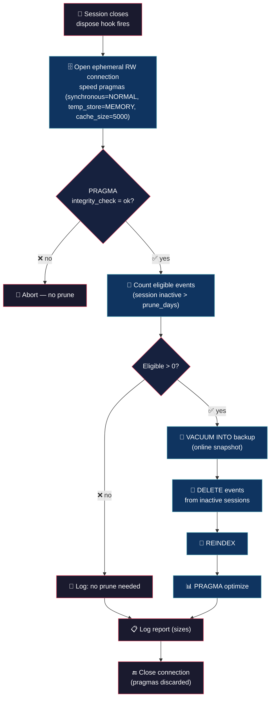

# DB Prunetor (keep opencode's brain lean)


> opencode's SQLite database grows forever. Event-sourcing rows pile up from sessions you'll never reopen. Your AI should not choke on its own history.

## 💡 What it does

> Lightweight, automatic database maintenance. You do nothing.

- **Copy and it works** — single TypeScript file, native `bun:sqlite`. No npm, no node_modules, no drama.

- **Runs on close** — maintenance fires on session `dispose`, when opencode releases its database connection. Zero startup cost, minimal contention.

- **Integrity gate** — `PRAGMA integrity_check` must return "ok" before anything is touched. A suspect database is never pruned.

- **Safe online backup** — before any destructive change, `VACUUM INTO` writes a consistent snapshot. No lock on the live database.

- **Event pruning** — deletes event-sourcing rows from sessions inactive beyond `prune_days`, then `REINDEX` + `PRAGMA optimize` to keep indexes and planner statistics healthy.

- **Ligero en vivo** — everything goes through the WAL. No `VACUUM`, no `wal_checkpoint(TRUNCATE)`. Freed pages return to the freelist for reuse; the file does not shrink (heavy offline compaction was intentionally out of scope).

## 🧠 Philosophy

Maintenance is a habit, not an emergency. A small, safe pass on every session close beats a scary 6 GB cleanup after months of neglect.

The plugin never blocks you, never touches opencode's own connection settings, and never mutates a database it cannot first prove is healthy.

## 🔄 How it works



## 🎯 Use cases

**Disk creep.** After weeks of sessions, `opencode.db-wal` and the `event` table bloat. The plugin trims the dead weight on every close.

**Replay safety.** Event-sourcing rows are only needed to reconstruct old sessions. Once a session goes inactive, its events are dead weight — the current state lives in `message`/`part`.

**Peace of mind.** An integrity gate plus an automatic online backup mean a prune can never be the thing that breaks your history.

## 🚀 Installation

```bash
cp db-prunetor.ts ~/.config/opencode/plugins/db-prunetor.ts
cp db-prunetor.jsonc ~/.config/opencode/db-prunetor.jsonc
```

No npm, no build step, no dependencies. OpenCode runs TypeScript natively. Restart opencode; maintenance runs automatically on close.

## ⚙️ Configuration

Copy `db-prunetor.jsonc` (included in this repo) to `~/.config/opencode/` and edit:

```jsonc
{
	"enabled": true,             // master switch
	"prune_days": 30,            // delete events from sessions inactive > N days
	"backup": true,              // VACUUM INTO safe online backup before prune
	"backup_path": "~/.local/share/opencode/opencode.db.bak",
	"db_path": "~/.local/share/opencode/opencode.db",
	"log_level": "info"          // "silent" | "error" | "info" | "debug"
}
```

| Field | Default | Description |
|---|---|---|
| `enabled` | `true` | Master switch |
| `prune_days` | `30` | Delete events from sessions inactive beyond this many days |
| `backup` | `true` | Write an online `VACUUM INTO` snapshot before pruning |
| `backup_path` | `~/.local/share/opencode/opencode.db.bak` | Where the pre-prune backup is written |
| `db_path` | `~/.local/share/opencode/opencode.db` | Location of opencode's database |
| `log_level` | `"info"` | `"silent"`, `"error"`, `"info"`, `"debug"` |

## 🪵 Logs

`~/.config/opencode/db-prunetor.log` (append-only). Format: `[TIMESTAMP] [LEVEL] message`.

```bash
tail -f ~/.config/opencode/db-prunetor.log
```

```log
[2026-08-23T21:30:00] [INFO]: Config loaded
[2026-08-23T21:30:01] [INFO]: Initialized
[2026-08-23T22:15:00] [INFO]: Integrity check: ok
[2026-08-23T22:15:00] [INFO]: Eligible events (inactive > 30d): 454878
[2026-08-23T22:15:02] [INFO]: Backup written: /home/alejo/.local/share/opencode/opencode.db.bak (1.17 GB)
[2026-08-23T22:15:05] [INFO]: Pruned events: 454878
[2026-08-23T22:15:06] [INFO]: Reindex + optimize done
[2026-08-23T22:15:06] [INFO]: Report — db: 1.17 GB, wal: 0.6 MB, shm: 32 KB, bak: 1.17 GB
[2026-08-23T22:15:06] [INFO]: Disposed
```

## 💬 Notes

- **Runs on `dispose`, not startup** — at close, opencode releases its DB connection, so contention is minimal and session startup is never slowed.
- **Integrity gate** — `PRAGMA integrity_check` must return "ok" before any mutation.
- **Online backup** — `VACUUM INTO` writes a consistent snapshot without locking the live database.
- **`time_updated` is epoch milliseconds** — the cutoff uses `strftime('%s','now','-N days') * 1000`.
- **`event.aggregate_id` = `session.id`** — the prune keys off that mapping.
- **Speed pragmas are ephemeral** — `synchronous=NORMAL`, `temp_store=MEMORY`, `cache_size=5000` are set only on the maintenance connection and discarded on close. They never touch opencode's own connection. `NORMAL` keeps WAL crash-safety for the destructive `DELETE` (no `OFF`), and `cache_size=5000` (~20 MB) is enough for a DELETE+REINDEX workload.
- **Ligero en vivo** — no `VACUUM`, no `wal_checkpoint(TRUNCATE)`. Freed pages go to the freelist; the file does not shrink.

Less is more. :)

## 👤 Authors

- Alejandro Carraretto

## 📄 License

MIT — version 0.1.0
